# BayarSendiri - Aplikasi Pembayaran Tagihan Digital

**BayarSendiri** adalah aplikasi web frontend yang mensimulasikan proses pembayaran berbagai tagihan rutin masyarakat Indonesia serta pengisian pulsa dan paket data. Aplikasi ini sepenuhnya berjalan di sisi klien (client-side) tanpa backend server nyata.

## Demo ID & Kode
| Fitur | ID/Kode Demo | Keterangan |
|-------|-------------|------------|
| **Listrik PLN** | `1234567890` | Budi Santoso - Tagihan Rp350.000 |
| **Listrik PLN (Denda)** | `1234567891` | Siti Rahayu - Tagihan Rp275.000 + Denda Rp15.000 |
| **PDAM** | `PDAM123456` | Ahmad Dahlan - Tagihan Rp180.000 |
| **Internet** | `INET987654` | Dian Permata - Tagihan Rp450.000 + Denda Rp25.000 |
| **Seminar/Event** | `EVT2026001` | Seminar Tech 2026 - Rp500.000 |
| **SPP - NIM** | `123456789012` | Mahasiswa Demo - Teknik Informatika |
| **SPP - Kode Tagihan** | `986248962486438` | SPP Semester Ganjil - Cicilan ke-1 |

## Cara Menjalankan
1. **Clone atau download** repository ini
2. **Buka folder** `bayarsendiri/`
3. **Double-click** file `index.html`
4. **Run** file `index.html`

## Fitur yang Sudah Diimplementasikan
1. Dashboard / Beranda
Ringkasan saldo digital (Rp15.000.000)
Quick access button ke layanan (Listrik, PDAM, Pulsa, Kuliah)
Promo banner (Cashback 5%)
Tampilan responsif mobile-first
2. Bayar Tagihan (Listrik, PDAM, Internet, Event)
Form input dengan validasi (8-12 karakter)
Validasi berbeda per kategori:
Listrik: hanya angka
PDAM: alphanumeric
Internet: alphanumeric
Event: alphanumeric
Cek tagihan dengan data simulasi
Menampilkan detail tagihan (Nama, Alamat, Periode, Tagihan Pokok, Denda, Total, Jatuh Tempo)
Metode Pembayaran:
Virtual Account - Generate nomor VA unik (BCA, BNI, Mandiri)
QRIS - QR Code dengan QRCode.js + countdown timer 5 menit
Teller/Kasir - Kode pembayaran + daftar lokasi (Indomaret, Alfamart, Kantor Pos)
Loading state saat pembayaran
Bukti pembayaran (struk digital)
Cetak struk (window.print())
Download PDF (jsPDF)
3. Biaya Kuliah / SPP (Fitur Unggulan)
Input NIM dengan validasi (12 digit angka)
Tabel daftar cicilan (8 item):
SPP Semester Ganjil 2025/2026 - Cicilan ke-1 s/d ke-3
Biaya Praktikum Laboratorium
Biaya UTS
Biaya UAS
Biaya Kegiatan Mahasiswa
Biaya Perpustakaan
Kolom: No, Kode, Deskripsi, Jumlah, Status (Lunas/Belum Lunas), Checkbox
Multi-select cicilan dengan checkbox
Total otomatis terhitung dari cicilan yang dipilih
Cek Detail Kode Tagihan (input kode tagihan)
Menampilkan detail: Kode, Deskripsi, NIM, Mahasiswa, Semester, Jumlah, Status
Metode pembayaran lengkap (VA, QRIS, Teller)
4. Isi Pulsa & Paket Data
Provider dalam grid card:
Telkomsel, XL Axiata, Indosat Ooredoo, Tri (3), Smartfren, Axis
Nominal pulsa: Rp10.000, Rp25.000, Rp50.000, Rp100.000, Rp200.000
Custom nominal (input manual)
Paket data: 5GB, 10GB, 25GB, 50GB
Validasi nomor HP (10-13 digit, diawali 08)
Preview pembelian sebelum bayar (Provider, Nomor, Produk, Harga)
Metode pembayaran lengkap
5. Riwayat Transaksi
Tabel histori transaksi
Menampilkan semua jenis transaksi (tagihan, SPP, pulsa)
Data tersimpan di localStorage
6. Profil User
Informasi pengguna (Nama, Email, Phone)
Saldo terkini
Total transaksi
7. Fitur Tambahan
Dark/Light Mode toggle dengan penyimpanan preferensi
Responsive Design (Mobile-First, max-width 480px)
LocalStorage untuk persistensi data
Toast notifications untuk feedback
Modal konfirmasi sebelum transaksi
Loading spinner saat proses pembayaran
SPA Style Navigation (Single Page Application)
Bottom Navigation 5 tab (Beranda, Tagihan, Kuliah, Pulsa, Riwayat)
Font Awesome 6 untuk ikon
QRCode.js untuk generate QR Code
jsPDF untuk download PDF

## Screenshot tampilan di mobile
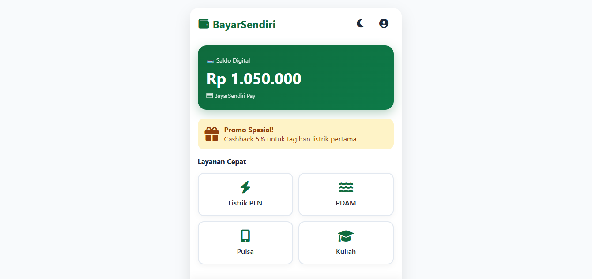
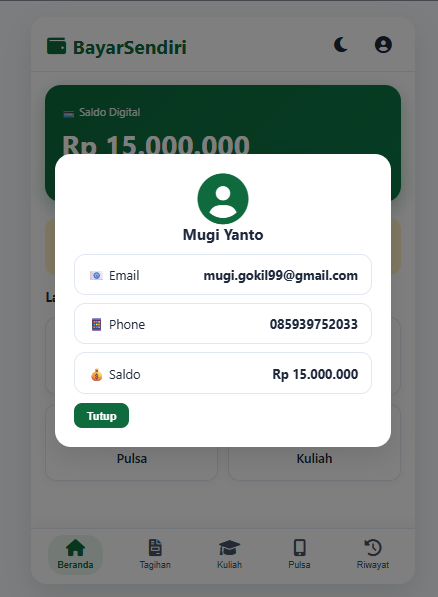
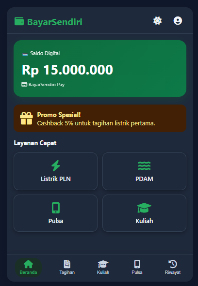
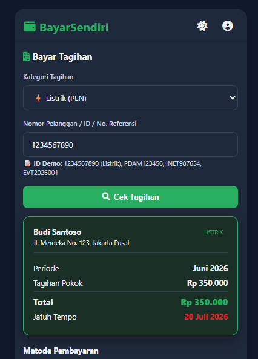
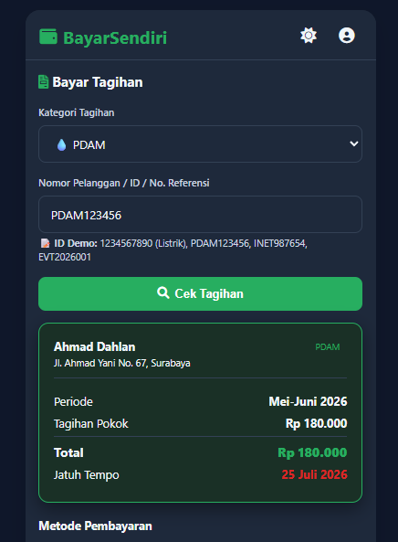
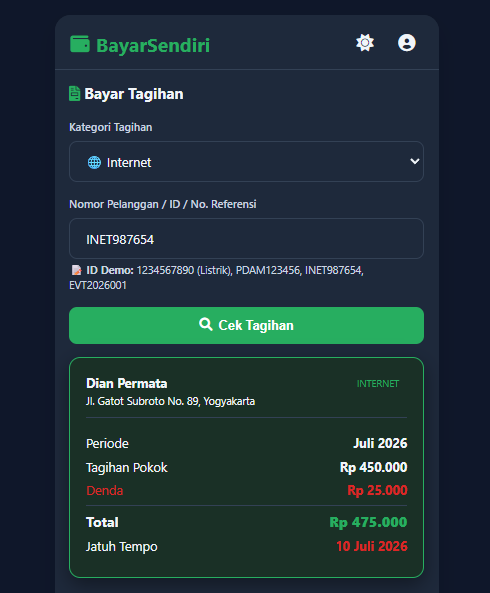
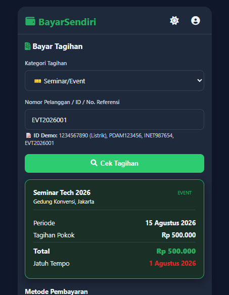
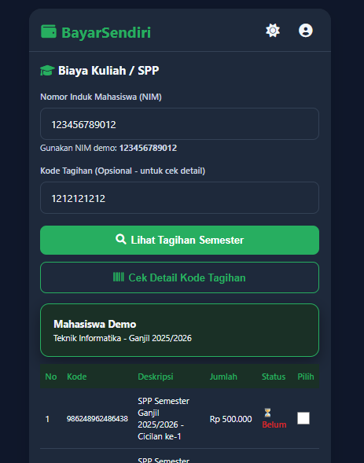
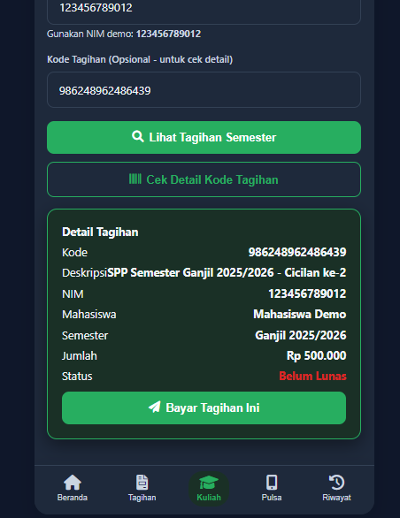
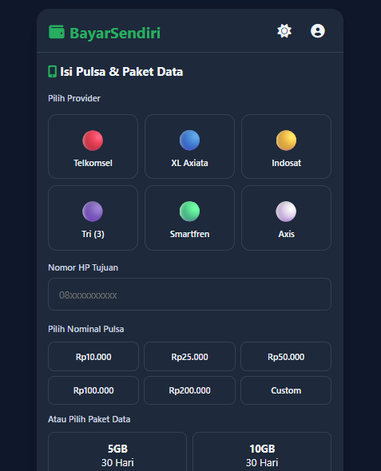
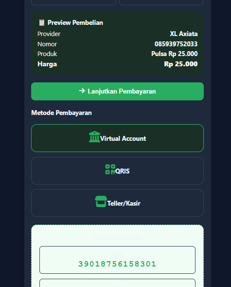
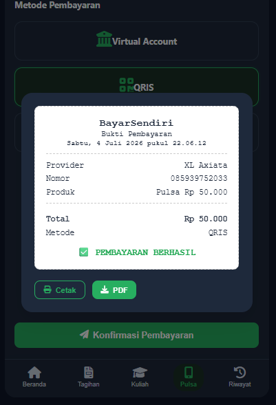
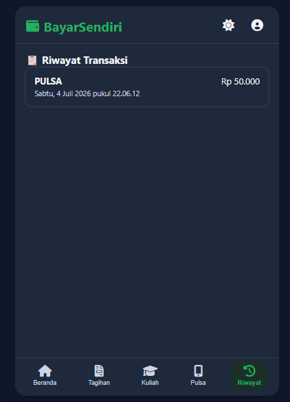

## Video Dokumentasi
